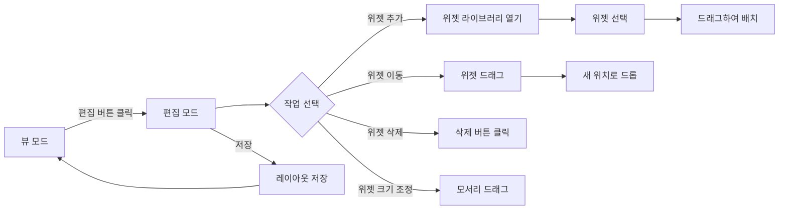

# 📋 대시보드 위젯 시스템 설계서

## 🎯 개요

### 목표
아이패드 위젯 시스템과 같은 자유로운 커스터마이징이 가능한 대시보드 시스템 구축

### 핵심 기능
- **그리드 기반 레이아웃** (3×3, 4×4)
- **드래그 앤 드롭** 위젯 배치
- **편집 모드** 토글
- **사용자 유형별 템플릿** (프로젝트형, 세무형, 빈 화면)
- **위젯 라이브러리** 사이드바
- **반응형 디자인**

## 🏗️ 시스템 아키텍처

### 기술 스택
```yaml
프레임워크:
  - Next.js 14 (App Router)
  - React 18
  - TypeScript

상태관리:
  - Zustand (글로벌 상태)
  - React Hook Form (폼 상태)

드래그앤드롭:
  - @dnd-kit/sortable
  - @dnd-kit/core

스타일링:
  - Tailwind CSS
  - CSS Grid Layout
  - Framer Motion (애니메이션)

데이터 영속성:
  - Supabase (메인 저장소)
  - LocalStorage (임시 백업)
```

### 컴포넌트 구조
```
src/
├── components/
│   └── dashboard/
│       ├── DashboardContainer.tsx       # 메인 컨테이너
│       ├── GridLayout.tsx              # 그리드 레이아웃 엔진
│       ├── WidgetWrapper.tsx           # 위젯 컨테이너 (드래그 핸들 포함)
│       ├── EditModeToolbar.tsx         # 편집 모드 컨트롤
│       ├── WidgetLibrary.tsx           # 위젯 선택 사이드바
│       ├── OnboardingModal.tsx         # 첫 사용자 템플릿 선택
│       ├── widgets/                    # 개별 위젯 컴포넌트
│       │   ├── base/
│       │   │   ├── BaseWidget.tsx
│       │   │   └── WidgetInterface.ts
│       │   ├── project/
│       │   │   ├── ProjectSummaryWidget.tsx
│       │   │   ├── ProjectTimelineWidget.tsx
│       │   │   ├── TaskTrackerWidget.tsx
│       │   │   └── MilestoneWidget.tsx
│       │   ├── tax/
│       │   │   ├── TaxDeadlineWidget.tsx
│       │   │   ├── TaxCalculatorWidget.tsx
│       │   │   ├── ExpenseTrackerWidget.tsx
│       │   │   └── TaxDocumentWidget.tsx
│       │   └── analytics/
│       │       ├── RevenueChartWidget.tsx
│       │       ├── CashFlowWidget.tsx
│       │       ├── KPIWidget.tsx
│       │       └── TrendAnalysisWidget.tsx
│       ├── templates/
│       │   ├── projectTemplate.ts
│       │   ├── taxTemplate.ts
│       │   └── blankTemplate.ts
│       └── hooks/
│           ├── useDashboardStore.ts
│           ├── useWidgetRegistry.ts
│           └── useGridLayout.ts
├── lib/
│   ├── services/
│   │   └── dashboard/
│   │       ├── layoutService.ts
│   │       ├── widgetService.ts
│   │       └── templateService.ts
│   └── utils/
│       └── dashboard/
│           ├── gridHelpers.ts
│           ├── collisionDetection.ts
│           └── layoutPersistence.ts
└── app/
    └── dashboard/
        ├── page.tsx                    # 서버 컴포넌트
        └── layout.tsx
```

## 📊 데이터 모델

### 핵심 타입 정의
```typescript
// 위젯 타입
type WidgetType = 
  | 'project-summary' | 'project-timeline' | 'task-tracker' | 'milestone-tracker'
  | 'tax-deadline' | 'tax-calculator' | 'expense-tracker' | 'tax-document'
  | 'revenue-chart' | 'cash-flow' | 'kpi-metrics' | 'trend-analysis';

// 위젯 크기
interface WidgetSize {
  width: number;  // 1-4 그리드 칸
  height: number; // 1-4 그리드 칸
}

// 그리드 위치
interface GridPosition {
  x: number;      // 0-3 (4×4 그리드 기준)
  y: number;      // 0-3
  width: number;  // 1-4
  height: number; // 1-4
}

// 위젯 정의
interface Widget {
  id: string;
  type: WidgetType;
  gridPosition: GridPosition;
  config?: Record<string, any>;
  isLocked?: boolean;
  lastUpdated?: Date;
}

// 대시보드 레이아웃
interface DashboardLayout {
  id: string;
  userId: string;
  name: string;
  gridSize: '3x3' | '4x4';
  widgets: Widget[];
  templateType?: 'project' | 'tax' | 'blank' | 'custom';
  isDefault: boolean;
  createdAt: Date;
  updatedAt: Date;
}

// 위젯 레지스트리
interface WidgetDefinition {
  type: WidgetType;
  name: string;
  description: string;
  icon: React.ComponentType;
  component: React.LazyExoticComponent<React.ComponentType<WidgetProps>>;
  defaultSize: WidgetSize;
  minSize?: WidgetSize;
  maxSize?: WidgetSize;
  category: 'project' | 'tax' | 'analytics' | 'utility';
  permissions?: string[];
  configSchema?: any; // JSON Schema for config validation
}
```

## 🔄 상태 관리

### Zustand Store 구조
```typescript
interface DashboardStore {
  // 레이아웃 상태
  currentLayout: DashboardLayout | null;
  layouts: DashboardLayout[];
  activeLayoutId: string | null;
  
  // UI 상태
  editMode: boolean;
  isDragging: boolean;
  selectedWidget: string | null;
  showWidgetLibrary: boolean;
  gridSize: '3x3' | '4x4';
  
  // 드래그 상태
  draggedWidget: Widget | null;
  dropTarget: GridPosition | null;
  
  // 액션 - 레이아웃
  setLayout: (layout: DashboardLayout) => void;
  loadLayout: (layoutId: string) => Promise<void>;
  saveLayout: () => Promise<void>;
  createLayout: (name: string, template?: 'project' | 'tax' | 'blank') => Promise<void>;
  deleteLayout: (layoutId: string) => Promise<void>;
  
  // 액션 - 위젯
  addWidget: (widget: Widget) => void;
  removeWidget: (widgetId: string) => void;
  updateWidget: (widgetId: string, updates: Partial<Widget>) => void;
  moveWidget: (widgetId: string, newPosition: GridPosition) => void;
  resizeWidget: (widgetId: string, newSize: WidgetSize) => void;
  
  // 액션 - UI
  toggleEditMode: () => void;
  setSelectedWidget: (widgetId: string | null) => void;
  toggleWidgetLibrary: () => void;
  setGridSize: (size: '3x3' | '4x4') => void;
  
  // 액션 - 드래그
  startDrag: (widget: Widget) => void;
  endDrag: () => void;
  setDropTarget: (position: GridPosition | null) => void;
  
  // 액션 - 템플릿
  applyTemplate: (templateType: 'project' | 'tax' | 'blank') => void;
  resetLayout: () => void;
}
```

## 🎨 사용자 경험 (UX)

### 편집 모드 워크플로우


### 온보딩 플로우
```typescript
// 첫 사용자 경험
const OnboardingFlow = {
  1: "환영 메시지",
  2: "템플릿 선택 모달",
  3: "선택된 템플릿 적용",
  4: "편집 방법 투어 (선택적)",
  5: "대시보드 사용 시작"
};

// 템플릿 옵션
const TemplateOptions = [
  {
    id: 'project',
    title: '프로젝트 중심형',
    description: '프로젝트 관리에 최적화된 위젯 구성',
    preview: '/images/project-template.png',
    widgets: PROJECT_TEMPLATE
  },
  {
    id: 'tax',
    title: '세무 중심형',
    description: '세무 관리에 최적화된 위젯 구성',
    preview: '/images/tax-template.png',
    widgets: TAX_TEMPLATE
  },
  {
    id: 'blank',
    title: '빈 화면',
    description: '처음부터 직접 구성',
    preview: '/images/blank-template.png',
    widgets: []
  }
];
```

## 🚀 드래그 앤 드롭 시스템

### 충돌 감지 알고리즘
```typescript
// 충돌 감지
function detectCollision(
  newPosition: GridPosition,
  existingWidgets: Widget[],
  gridSize: number
): boolean {
  // 1. 그리드 경계 체크
  if (newPosition.x < 0 || newPosition.y < 0 ||
      newPosition.x + newPosition.width > gridSize ||
      newPosition.y + newPosition.height > gridSize) {
    return true;
  }
  
  // 2. 다른 위젯과의 충돌 체크
  return existingWidgets.some(widget => {
    if (widget.id === newPosition.id) return false; // 자기 자신 제외
    
    const collision = !(
      newPosition.x >= widget.gridPosition.x + widget.gridPosition.width ||
      newPosition.x + newPosition.width <= widget.gridPosition.x ||
      newPosition.y >= widget.gridPosition.y + widget.gridPosition.height ||
      newPosition.y + newPosition.height <= widget.gridPosition.y
    );
    
    return collision;
  });
}

// 자동 배치 알고리즘
function findBestPosition(
  widget: Widget,
  existingWidgets: Widget[],
  gridSize: number
): GridPosition | null {
  const size = { 
    width: widget.gridPosition.width, 
    height: widget.gridPosition.height 
  };
  
  // 왼쪽 위부터 오른쪽 아래로 스캔
  for (let y = 0; y <= gridSize - size.height; y++) {
    for (let x = 0; x <= gridSize - size.width; x++) {
      const position = { x, y, ...size };
      if (!detectCollision(position, existingWidgets, gridSize)) {
        return position;
      }
    }
  }
  
  return null; // 공간 없음
}

// 스마트 리플로우
function reflow(widgets: Widget[], gridSize: number): Widget[] {
  // 위젯을 y, x 순으로 정렬
  const sorted = [...widgets].sort((a, b) => {
    if (a.gridPosition.y === b.gridPosition.y) {
      return a.gridPosition.x - b.gridPosition.x;
    }
    return a.gridPosition.y - b.gridPosition.y;
  });
  
  const reflowed: Widget[] = [];
  
  sorted.forEach(widget => {
    const bestPosition = findBestPosition(widget, reflowed, gridSize);
    if (bestPosition) {
      reflowed.push({
        ...widget,
        gridPosition: bestPosition
      });
    }
  });
  
  return reflowed;
}
```

## 🎯 위젯 개발 가이드

### 기본 위젯 인터페이스
```typescript
// 모든 위젯이 구현해야 하는 Props
interface WidgetProps {
  id: string;
  config?: any;
  isEditMode: boolean;
  onConfigChange?: (config: any) => void;
  onRemove?: () => void;
}

// 위젯 베이스 클래스
abstract class BaseWidget<TConfig = any> extends React.Component<
  WidgetProps & { config: TConfig }
> {
  // 필수 구현 메서드
  abstract render(): React.ReactNode;
  
  // 선택적 구현 메서드
  onEditModeEnter?(): void;
  onEditModeExit?(): void;
  validateConfig?(config: TConfig): boolean;
  getDefaultConfig?(): TConfig;
  
  // 공통 유틸리티
  protected handleConfigChange = (updates: Partial<TConfig>) => {
    const newConfig = { ...this.props.config, ...updates };
    if (this.validateConfig?.(newConfig) ?? true) {
      this.props.onConfigChange?.(newConfig);
    }
  };
}

// 위젯 예시
export const ProjectSummaryWidget: React.FC<WidgetProps> = ({ 
  config, 
  isEditMode 
}) => {
  const [projects, setProjects] = useState<Project[]>([]);
  
  useEffect(() => {
    // 프로젝트 데이터 로드
    loadProjects().then(setProjects);
  }, []);
  
  if (isEditMode) {
    return (
      <Card className="h-full flex items-center justify-center">
        <Typography variant="body2" className="text-txt-secondary">
          프로젝트 요약 위젯
        </Typography>
      </Card>
    );
  }
  
  return (
    <Card className="h-full p-4">
      <Typography variant="h3" className="mb-3">
        프로젝트 현황
      </Typography>
      <div className="space-y-2">
        {projects.map(project => (
          <ProjectItem key={project.id} project={project} />
        ))}
      </div>
    </Card>
  );
};
```

## 📱 반응형 디자인

### 브레이크포인트별 그리드 크기
```typescript
const getResponsiveGridConfig = (width: number): GridConfig => {
  if (width < 640) {
    // 모바일 (sm)
    return {
      gridSize: '2x2',
      maxWidgetWidth: 2,
      maxWidgetHeight: 2,
      gap: 8,
      padding: 12
    };
  } else if (width < 1024) {
    // 태블릿 (md-lg)
    return {
      gridSize: '3x3',
      maxWidgetWidth: 3,
      maxWidgetHeight: 3,
      gap: 12,
      padding: 16
    };
  } else {
    // 데스크톱 (xl+)
    return {
      gridSize: '4x4',
      maxWidgetWidth: 4,
      maxWidgetHeight: 4,
      gap: 16,
      padding: 20
    };
  }
};

// 위젯 크기 자동 조정
const adjustWidgetForScreen = (
  widget: Widget,
  config: GridConfig
): Widget => {
  const adjustedWidth = Math.min(
    widget.gridPosition.width,
    config.maxWidgetWidth
  );
  const adjustedHeight = Math.min(
    widget.gridPosition.height,
    config.maxWidgetHeight
  );
  
  return {
    ...widget,
    gridPosition: {
      ...widget.gridPosition,
      width: adjustedWidth,
      height: adjustedHeight,
      x: Math.min(widget.gridPosition.x, config.gridSize - adjustedWidth),
      y: Math.min(widget.gridPosition.y, config.gridSize - adjustedHeight)
    }
  };
};
```

## ⚡ 성능 최적화

### 최적화 전략
```typescript
// 1. 위젯 Lazy Loading
const WidgetComponents = {
  'project-summary': lazy(() => import('./widgets/project/ProjectSummaryWidget')),
  'tax-calculator': lazy(() => import('./widgets/tax/TaxCalculatorWidget')),
  // ... 더 많은 위젯
};

// 2. 메모이제이션
const MemoizedWidget = React.memo(({ widget, isEditMode }) => {
  const Component = WidgetComponents[widget.type];
  
  return (
    <Suspense fallback={<WidgetSkeleton />}>
      <Component {...widget} isEditMode={isEditMode} />
    </Suspense>
  );
}, (prevProps, nextProps) => {
  // 편집 모드나 위젯 데이터가 변경되지 않았으면 리렌더링 스킵
  return (
    prevProps.isEditMode === nextProps.isEditMode &&
    prevProps.widget.id === nextProps.widget.id &&
    prevProps.widget.gridPosition === nextProps.widget.gridPosition &&
    prevProps.widget.config === nextProps.widget.config
  );
});

// 3. 드래그 최적화
const DragPreview = ({ widget }) => {
  // 드래그 중에는 간단한 프리뷰만 표시
  return (
    <div className="bg-weave-primary/20 border-2 border-weave-primary border-dashed rounded-lg">
      <div className="p-4 text-center">
        <Typography variant="body2">{widget.name}</Typography>
      </div>
    </div>
  );
};

// 4. 디바운스된 저장
const debouncedSave = useMemo(
  () => debounce((layout: DashboardLayout) => {
    saveLayoutToDatabase(layout);
  }, 1000),
  []
);
```

## 🔒 보안 및 권한

### 위젯 권한 관리
```typescript
interface WidgetPermissions {
  canView: boolean;
  canEdit: boolean;
  canDelete: boolean;
  canResize: boolean;
  requiredRole?: 'admin' | 'manager' | 'user';
}

// 권한 체크
const checkWidgetPermission = (
  widget: WidgetDefinition,
  user: User
): WidgetPermissions => {
  const basePermissions = {
    canView: true,
    canEdit: user.role !== 'viewer',
    canDelete: user.role === 'admin' || user.role === 'manager',
    canResize: user.role !== 'viewer'
  };
  
  // 위젯별 특별 권한
  if (widget.permissions?.includes('admin-only')) {
    return {
      ...basePermissions,
      canView: user.role === 'admin',
      canEdit: user.role === 'admin'
    };
  }
  
  return basePermissions;
};
```

## 📦 데이터베이스 스키마

### Supabase 테이블 구조
```sql
-- 대시보드 레이아웃 테이블
CREATE TABLE dashboard_layouts (
  id UUID PRIMARY KEY DEFAULT uuid_generate_v4(),
  user_id UUID REFERENCES auth.users(id) ON DELETE CASCADE,
  name VARCHAR(255) NOT NULL,
  grid_size VARCHAR(10) NOT NULL CHECK (grid_size IN ('3x3', '4x4')),
  template_type VARCHAR(50),
  is_default BOOLEAN DEFAULT false,
  created_at TIMESTAMP WITH TIME ZONE DEFAULT CURRENT_TIMESTAMP,
  updated_at TIMESTAMP WITH TIME ZONE DEFAULT CURRENT_TIMESTAMP
);

-- 위젯 테이블
CREATE TABLE dashboard_widgets (
  id UUID PRIMARY KEY DEFAULT uuid_generate_v4(),
  layout_id UUID REFERENCES dashboard_layouts(id) ON DELETE CASCADE,
  widget_type VARCHAR(100) NOT NULL,
  grid_x INTEGER NOT NULL CHECK (grid_x >= 0),
  grid_y INTEGER NOT NULL CHECK (grid_y >= 0),
  width INTEGER NOT NULL CHECK (width > 0 AND width <= 4),
  height INTEGER NOT NULL CHECK (height > 0 AND height <= 4),
  config JSONB,
  is_locked BOOLEAN DEFAULT false,
  created_at TIMESTAMP WITH TIME ZONE DEFAULT CURRENT_TIMESTAMP,
  updated_at TIMESTAMP WITH TIME ZONE DEFAULT CURRENT_TIMESTAMP
);

-- 위젯 템플릿 테이블
CREATE TABLE widget_templates (
  id UUID PRIMARY KEY DEFAULT uuid_generate_v4(),
  type VARCHAR(50) NOT NULL UNIQUE,
  name VARCHAR(255) NOT NULL,
  description TEXT,
  default_config JSONB,
  created_at TIMESTAMP WITH TIME ZONE DEFAULT CURRENT_TIMESTAMP
);

-- 인덱스
CREATE INDEX idx_dashboard_layouts_user_id ON dashboard_layouts(user_id);
CREATE INDEX idx_dashboard_widgets_layout_id ON dashboard_widgets(layout_id);
CREATE INDEX idx_widget_templates_type ON widget_templates(type);
```

## 🚦 구현 로드맵

### Phase 1: 기본 인프라 (1주)
- [ ] 그리드 레이아웃 시스템 구현
- [ ] 기본 위젯 컨테이너 개발
- [ ] Zustand 스토어 설정
- [ ] 편집 모드 토글 기능

### Phase 2: 드래그 앤 드롭 (1주)
- [ ] @dnd-kit 통합
- [ ] 충돌 감지 알고리즘
- [ ] 위젯 이동 기능
- [ ] 자동 리플로우

### Phase 3: 위젯 라이브러리 (2주)
- [ ] 위젯 레지스트리 구현
- [ ] 기본 위젯 5개 개발
  - [ ] 프로젝트 요약
  - [ ] 세무 달력
  - [ ] 수익 차트
  - [ ] 작업 추적기
  - [ ] KPI 메트릭
- [ ] 위젯 라이브러리 UI

### Phase 4: 템플릿 & 온보딩 (1주)
- [ ] 템플릿 시스템 구현
- [ ] 온보딩 모달 개발
- [ ] 프로젝트형/세무형 템플릿
- [ ] 첫 사용자 경험 최적화

### Phase 5: 영속성 & 최적화 (1주)
- [ ] Supabase 통합
- [ ] 자동 저장 기능
- [ ] 성능 최적화
- [ ] 반응형 디자인 완성

### Phase 6: 고급 기능 (2주)
- [ ] 위젯 크기 조정
- [ ] 위젯 설정 패널
- [ ] 키보드 단축키
- [ ] 접근성 개선
- [ ] 애니메이션 효과

## 🔧 개발 가이드라인

### 코드 컨벤션
```typescript
// 파일 명명 규칙
WidgetName.tsx          // 컴포넌트
useWidgetHook.ts       // 커스텀 훅
widgetService.ts       // 서비스
widgetTypes.ts         // 타입 정의
widgetUtils.ts         // 유틸리티

// 컴포넌트 구조
export const WidgetComponent: React.FC<Props> = ({
  prop1,
  prop2,
  ...rest
}) => {
  // 1. State & Hooks
  const [state, setState] = useState();
  const store = useDashboardStore();
  
  // 2. Effects
  useEffect(() => {
    // 초기화 로직
  }, []);
  
  // 3. Handlers
  const handleClick = useCallback(() => {
    // 핸들러 로직
  }, []);
  
  // 4. Render
  return (
    <div>
      {/* JSX */}
    </div>
  );
};
```

### 테스팅 전략
```typescript
// 단위 테스트
describe('Widget', () => {
  it('should render correctly', () => {
    const { getByText } = render(<Widget />);
    expect(getByText('Widget Title')).toBeInTheDocument();
  });
  
  it('should handle drag and drop', () => {
    // 드래그 앤 드롭 테스트
  });
});

// 통합 테스트
describe('Dashboard Integration', () => {
  it('should save layout to database', async () => {
    // 레이아웃 저장 테스트
  });
});
```

## 📈 성공 지표

### 기술적 지표
- 페이지 로드 시간 < 2초
- 드래그 앤 드롭 FPS > 30
- 레이아웃 저장 시간 < 500ms
- 코드 커버리지 > 80%

### 사용자 경험 지표
- 온보딩 완료율 > 90%
- 위젯 커스터마이징 사용률 > 70%
- 편집 모드 평균 사용 시간 < 5분
- 사용자 만족도 > 4.5/5

## 🎯 결론

이 설계는 확장 가능하고 유지보수가 쉬운 위젯 시스템을 제공합니다. 
주요 특징:
- **모듈화**: 새 위젯을 쉽게 추가 가능
- **유연성**: 다양한 사용자 요구 충족
- **성능**: 최적화된 렌더링과 상태 관리
- **사용성**: 직관적인 드래그 앤 드롭 인터페이스
- **확장성**: 미래 기능 추가 고려한 설계

이 시스템은 Weave 프로젝트의 핵심 기능으로 자리잡아 사용자들에게 
개인화된 대시보드 경험을 제공할 것입니다.