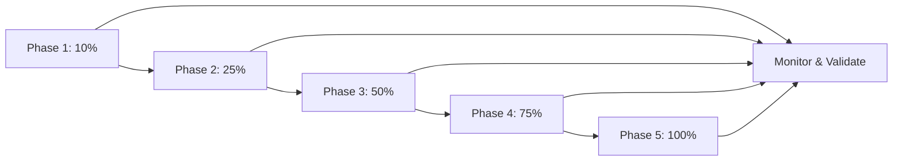
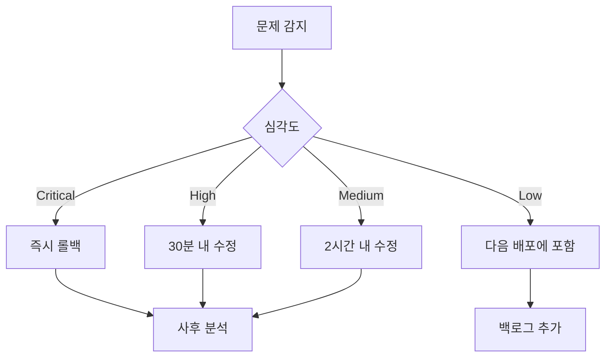

# 🚀 iOS 스타일 대시보드 프로덕션 배포 가이드

## 목차
1. [배포 전 체크리스트](#배포-전-체크리스트)
2. [환경 설정](#환경-설정)
3. [Feature Flag 설정](#feature-flag-설정)
4. [모니터링 설정](#모니터링-설정)
5. [배포 전략](#배포-전략)
6. [롤백 계획](#롤백-계획)
7. [운영 가이드](#운영-가이드)

---

## 배포 전 체크리스트

### ✅ 기술적 검증
- [ ] 모든 테스트 통과
  - [ ] Unit Tests: `npm run test`
  - [ ] Integration Tests: `npm run test:integration`
  - [ ] E2E Tests: `npm run test:e2e`
- [ ] 빌드 성공: `npm run build`
- [ ] 타입 체크 통과: `npm run type-check`
- [ ] Lint 검사 통과: `npm run lint`
- [ ] 성능 기준 충족
  - [ ] P95 < 100ms
  - [ ] 메모리 사용량 < 200MB
  - [ ] FPS > 55

### ✅ 비즈니스 검증
- [ ] 사용자 가이드 작성 완료
- [ ] 내부 테스트 완료 (QA 팀)
- [ ] 베타 테스트 피드백 반영
- [ ] 롤백 계획 수립
- [ ] 모니터링 알림 설정

---

## 환경 설정

### 프로덕션 환경 변수 (.env.production)

```bash
# 기본 설정
NODE_ENV=production
NEXT_PUBLIC_API_URL=https://api.production.com
NEXT_PUBLIC_APP_URL=https://app.production.com

# iOS 스타일 대시보드
NEXT_PUBLIC_IOS_STYLE_ENABLED=true
NEXT_PUBLIC_IOS_STYLE_ROLLOUT_PERCENTAGE=50  # 50% 점진적 롤아웃

# Feature Flags
NEXT_PUBLIC_FEATURE_FLAG_SERVICE=true
NEXT_PUBLIC_FEATURE_FLAG_DEBUG=false

# 성능 모니터링
NEXT_PUBLIC_PERFORMANCE_MONITOR=true
NEXT_PUBLIC_PERFORMANCE_THRESHOLD_FPS=30
NEXT_PUBLIC_PERFORMANCE_THRESHOLD_MEMORY=80  # percentage
NEXT_PUBLIC_PERFORMANCE_THRESHOLD_LATENCY=100  # ms

# A/B 테스트
NEXT_PUBLIC_AB_TEST_ENABLED=true
NEXT_PUBLIC_AB_TEST_IOS_STYLE=true
NEXT_PUBLIC_AB_TEST_CONTROL_GROUP=50  # percentage

# 자동 롤백
NEXT_PUBLIC_AUTO_ROLLBACK_ENABLED=true
NEXT_PUBLIC_ROLLBACK_ERROR_THRESHOLD=5  # percentage
NEXT_PUBLIC_ROLLBACK_LATENCY_THRESHOLD=200  # ms
NEXT_PUBLIC_ROLLBACK_COOLDOWN=3600000  # 1 hour in ms

# Supabase
NEXT_PUBLIC_SUPABASE_URL=https://your-project.supabase.co
NEXT_PUBLIC_SUPABASE_ANON_KEY=your-anon-key

# Monitoring
NEXT_PUBLIC_SENTRY_DSN=https://your-sentry-dsn
NEXT_PUBLIC_ANALYTICS_ID=your-analytics-id
NEXT_PUBLIC_LOG_LEVEL=error

# CDN
NEXT_PUBLIC_CDN_URL=https://cdn.production.com
NEXT_PUBLIC_IMAGE_OPTIMIZATION=true
```

### 프로덕션 빌드 설정 (next.config.js)

```javascript
/** @type {import('next').NextConfig} */
const nextConfig = {
  reactStrictMode: true,
  swcMinify: true,
  
  // 프로덕션 최적화
  compiler: {
    removeConsole: process.env.NODE_ENV === 'production',
  },
  
  // 이미지 최적화
  images: {
    domains: ['cdn.production.com'],
    formats: ['image/avif', 'image/webp'],
  },
  
  // 성능 최적화
  experimental: {
    optimizeFonts: true,
    optimizeImages: true,
    optimizeCss: true,
  },
  
  // 보안 헤더
  async headers() {
    return [
      {
        source: '/:path*',
        headers: [
          {
            key: 'X-DNS-Prefetch-Control',
            value: 'on',
          },
          {
            key: 'X-XSS-Protection',
            value: '1; mode=block',
          },
          {
            key: 'X-Frame-Options',
            value: 'SAMEORIGIN',
          },
          {
            key: 'X-Content-Type-Options',
            value: 'nosniff',
          },
          {
            key: 'Referrer-Policy',
            value: 'origin-when-cross-origin',
          },
        ],
      },
    ];
  },
};

module.exports = nextConfig;
```

---

## Feature Flag 설정

### Feature Flag 서비스 설정

```typescript
// src/lib/features/production-config.ts

export const productionFeatureFlags = {
  iosStyleDashboard: {
    enabled: true,
    rollout: {
      strategy: 'percentage',
      percentage: 50,  // 초기 50% 롤아웃
      stages: [
        { date: '2025-01-21', percentage: 50 },
        { date: '2025-01-23', percentage: 75 },
        { date: '2025-01-25', percentage: 100 },
      ],
    },
    targeting: {
      // 특정 사용자 그룹 타겟팅
      betaUsers: true,
      premiumUsers: true,
      internalUsers: true,
    },
    monitoring: {
      metrics: ['error_rate', 'performance', 'user_engagement'],
      alertThresholds: {
        errorRate: 0.05,  // 5%
        latency: 200,     // ms
        engagement: 0.7,  // 70%
      },
    },
  },
};
```

### A/B 테스트 설정

```typescript
// src/lib/features/ab-test-production.ts

export const abTestConfig = {
  iosStyleDashboard: {
    name: 'ios_style_dashboard_prod',
    startDate: '2025-01-21',
    endDate: '2025-02-04',  // 2주 테스트
    
    groups: {
      control: {
        percentage: 50,
        features: {
          useIOSStyle: false,
        },
      },
      treatment: {
        percentage: 50,
        features: {
          useIOSStyle: true,
        },
      },
    },
    
    metrics: {
      primary: [
        'user_engagement_rate',
        'edit_mode_usage',
        'session_duration',
      ],
      secondary: [
        'error_rate',
        'page_load_time',
        'widget_interaction_rate',
      ],
    },
    
    successCriteria: {
      userEngagement: {
        metric: 'user_engagement_rate',
        lift: 0.1,  // 10% 향상
        confidence: 0.95,
      },
      errorRate: {
        metric: 'error_rate',
        threshold: 0.02,  // 2% 이하
      },
      performance: {
        metric: 'p95_latency',
        threshold: 100,  // 100ms 이하
      },
    },
  },
};
```

---

## 모니터링 설정

### 실시간 모니터링 대시보드

```typescript
// src/lib/monitoring/production-monitoring.ts

export class ProductionMonitoring {
  private static instance: ProductionMonitoring;
  
  // Metrics to track
  private metrics = {
    // Performance
    fps: [],
    memoryUsage: [],
    renderTime: [],
    p95Latency: [],
    
    // User Behavior
    activeUsers: 0,
    iosStyleUsers: 0,
    editModeActivations: 0,
    widgetInteractions: 0,
    
    // Errors
    errorCount: 0,
    errorRate: 0,
    crashCount: 0,
    
    // Business KPIs
    adoptionRate: 0,
    userSatisfaction: 0,
    sessionDuration: 0,
  };
  
  // Alert thresholds
  private alerts = {
    criticalErrorRate: 0.05,    // 5%
    highLatency: 200,           // ms
    lowFPS: 30,                // frames
    highMemory: 300,           // MB
    lowAdoption: 0.5,          // 50%
  };
  
  // Send alerts
  private sendAlert(type: string, message: string, severity: 'low' | 'medium' | 'high' | 'critical') {
    // Slack notification
    this.notifySlack(type, message, severity);
    
    // Email notification
    this.notifyEmail(type, message, severity);
    
    // PagerDuty for critical
    if (severity === 'critical') {
      this.notifyPagerDuty(type, message);
    }
    
    // Log to monitoring service
    this.logToMonitoring(type, message, severity);
  }
}
```

### 모니터링 통합

```yaml
# monitoring/docker-compose.yml

version: '3.8'

services:
  prometheus:
    image: prom/prometheus:latest
    ports:
      - "9090:9090"
    volumes:
      - ./prometheus.yml:/etc/prometheus/prometheus.yml
      - prometheus_data:/prometheus

  grafana:
    image: grafana/grafana:latest
    ports:
      - "3000:3000"
    environment:
      - GF_SECURITY_ADMIN_PASSWORD=admin
    volumes:
      - grafana_data:/var/lib/grafana

  alertmanager:
    image: prom/alertmanager:latest
    ports:
      - "9093:9093"
    volumes:
      - ./alertmanager.yml:/etc/alertmanager/alertmanager.yml

volumes:
  prometheus_data:
  grafana_data:
```

---

## 배포 전략

### 점진적 롤아웃 (Progressive Rollout)



#### Phase 1: 초기 배포 (10% - Day 1)
- 내부 사용자 및 베타 테스터
- 핵심 메트릭 모니터링
- 피드백 수집

#### Phase 2: 확대 배포 (25% - Day 3)
- 활성 사용자 일부 포함
- A/B 테스트 시작
- 성능 모니터링 강화

#### Phase 3: 중간 배포 (50% - Day 5)
- 절반의 사용자에게 배포
- 전체 메트릭 분석
- 롤백 판단 시점

#### Phase 4: 대규모 배포 (75% - Day 7)
- 대부분 사용자 포함
- 최종 검증
- 문제 발생 시 즉시 롤백

#### Phase 5: 전체 배포 (100% - Day 10)
- 모든 사용자 대상
- 레거시 시스템 비활성화 준비

### 배포 스크립트

```bash
#!/bin/bash
# deploy-production.sh

# 1. 환경 변수 설정
export NODE_ENV=production
export DEPLOYMENT_STAGE=$1  # 10, 25, 50, 75, 100

# 2. 테스트 실행
echo "Running tests..."
npm run test:all
if [ $? -ne 0 ]; then
    echo "Tests failed. Aborting deployment."
    exit 1
fi

# 3. 빌드
echo "Building application..."
npm run build
if [ $? -ne 0 ]; then
    echo "Build failed. Aborting deployment."
    exit 1
fi

# 4. 백업
echo "Creating backup..."
./scripts/backup.sh

# 5. Feature Flag 업데이트
echo "Updating feature flags..."
node scripts/update-feature-flags.js --percentage=$DEPLOYMENT_STAGE

# 6. 배포
echo "Deploying to production..."
npm run deploy:production

# 7. 헬스 체크
echo "Running health checks..."
./scripts/health-check.sh

# 8. 모니터링 시작
echo "Starting monitoring..."
./scripts/start-monitoring.sh

echo "Deployment complete! Stage: $DEPLOYMENT_STAGE%"
```

---

## 롤백 계획

### 자동 롤백 트리거

```typescript
// src/lib/rollback/auto-rollback.ts

export class AutoRollback {
  private static triggers = {
    errorRate: {
      threshold: 0.05,  // 5%
      duration: 300000,  // 5 minutes
    },
    crashRate: {
      threshold: 0.01,  // 1%
      duration: 60000,   // 1 minute
    },
    latency: {
      threshold: 200,    // ms
      duration: 600000,  // 10 minutes
    },
    memoryLeak: {
      threshold: 500,    // MB
      duration: 1800000, // 30 minutes
    },
  };
  
  static async checkAndRollback(): Promise<boolean> {
    const metrics = await this.getCurrentMetrics();
    
    for (const [trigger, config] of Object.entries(this.triggers)) {
      if (this.shouldTriggerRollback(metrics[trigger], config)) {
        await this.executeRollback(trigger);
        return true;
      }
    }
    
    return false;
  }
  
  private static async executeRollback(reason: string): Promise<void> {
    console.error(`[ROLLBACK] Triggered due to: ${reason}`);
    
    // 1. Feature Flag 비활성화
    await this.disableFeatureFlag('ios_style_dashboard');
    
    // 2. 사용자 알림
    await this.notifyUsers('시스템이 일시적으로 이전 버전으로 전환됩니다.');
    
    // 3. 팀 알림
    await this.notifyTeam(`Rollback executed: ${reason}`);
    
    // 4. 로그 기록
    await this.logRollback(reason);
    
    // 5. 백업에서 복원
    await this.restoreFromBackup();
  }
}
```

### 수동 롤백 절차

```bash
# 1. Feature Flag 비활성화
curl -X POST https://api.production.com/features/ios_style_dashboard \
  -H "Authorization: Bearer $API_TOKEN" \
  -d '{"enabled": false}'

# 2. 캐시 삭제
redis-cli FLUSHALL

# 3. CDN 캐시 무효화
aws cloudfront create-invalidation \
  --distribution-id $DISTRIBUTION_ID \
  --paths "/*"

# 4. 이전 버전으로 배포
git checkout $PREVIOUS_VERSION
npm run deploy:production

# 5. 헬스 체크
./scripts/health-check.sh
```

---

## 운영 가이드

### 일일 모니터링 체크리스트

#### 오전 체크 (9:00 AM)
- [ ] 에러율 확인 (< 1%)
- [ ] 성능 메트릭 확인 (P95 < 100ms)
- [ ] 사용자 피드백 확인
- [ ] 시스템 리소스 확인

#### 오후 체크 (2:00 PM)
- [ ] A/B 테스트 결과 확인
- [ ] 채택률 확인
- [ ] 위젯 사용 통계 확인
- [ ] 메모리 사용량 확인

#### 저녁 체크 (6:00 PM)
- [ ] 일일 보고서 생성
- [ ] 이슈 트래킹
- [ ] 다음날 계획 수립

### 문제 대응 프로세스



### 성공 지표 모니터링

| 지표 | 목표 | 현재 | 상태 |
|------|------|------|------|
| 채택률 | > 80% | - | 🟡 |
| 에러율 | < 1% | - | 🟢 |
| P95 지연 | < 100ms | - | 🟢 |
| 메모리 | < 200MB | - | 🟢 |
| 사용자 만족도 | > 4.5/5 | - | 🟡 |

### 연락처 및 에스컬레이션

#### Level 1: 개발팀
- Slack: #ios-dashboard-alerts
- Email: dev-team@company.com

#### Level 2: 팀 리더
- Phone: +1-XXX-XXX-XXXX
- PagerDuty: @team-lead

#### Level 3: CTO
- Phone: +1-XXX-XXX-XXXX
- Emergency Only

---

## 배포 후 검증

### 배포 후 24시간 체크리스트

#### T+1 Hour
- [ ] 기본 기능 동작 확인
- [ ] 에러 로그 확인
- [ ] 사용자 접속 정상

#### T+6 Hours
- [ ] 성능 메트릭 분석
- [ ] A/B 테스트 데이터 수집 시작
- [ ] 초기 사용자 피드백 확인

#### T+12 Hours
- [ ] 첫 반일 보고서 작성
- [ ] 이슈 대응 현황 정리
- [ ] 롤백 필요성 평가

#### T+24 Hours
- [ ] 일일 종합 보고서
- [ ] 다음 단계 배포 결정
- [ ] 개선 사항 정리

---

**문서 버전**: 1.0.0  
**작성일**: 2025-01-20  
**작성자**: DevOps Team  
**다음 리뷰**: 2025-01-27

*이 문서는 배포 진행 상황에 따라 업데이트됩니다.*